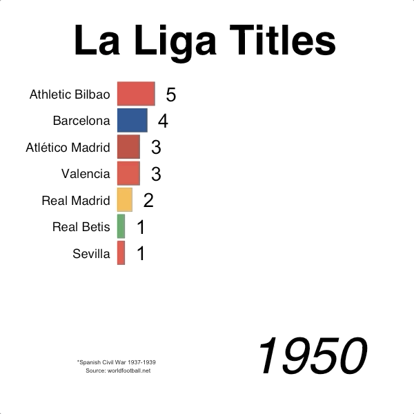

# Bar Chart Race
This bar chart race shows La Liga title winners since its inception in 1929. La Liga is the men's top professional football (soccer) division in Spain.

## Motivation
These bar chart races have become popular and they can be a great way to learn a lot of information in a short amount of time. After doing some research, I found a way to do this in r with a package called gganimate.

## Notes
Once you understand how the data needs to be structured and the basics of the animation, it's easy to see how you could animate more different things. This is a simple example and can be easily adjusted.

## Libraries used
```
library(gganimate)
library(tidyverse)
```
## Gif


### Thanks to
* [gganimate](https://github.com/thomasp85/gganimate) - animation package
* [worldfootball.net](https://www.worldfootball.net/) - data source